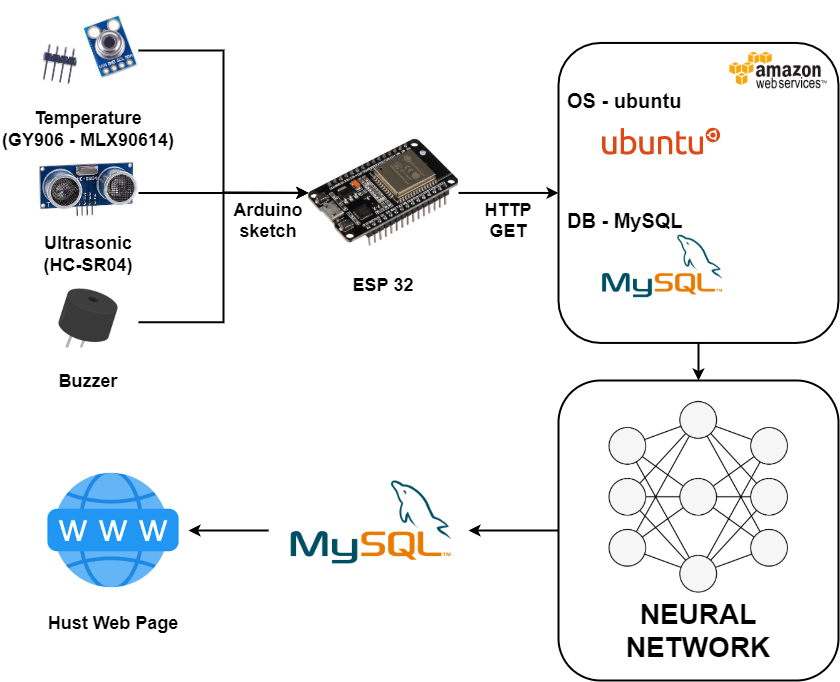
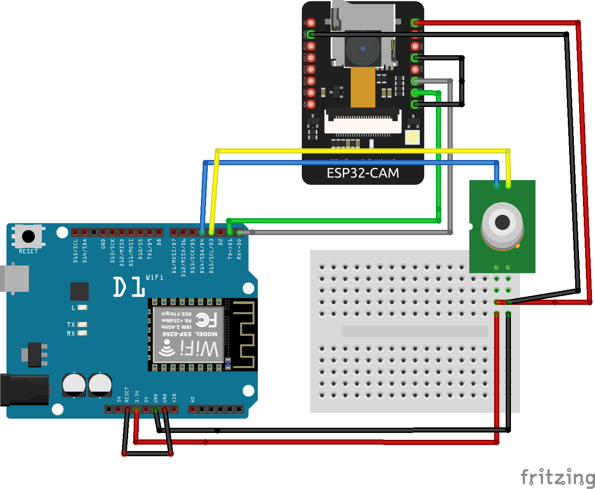
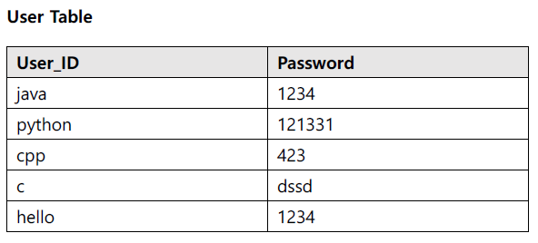
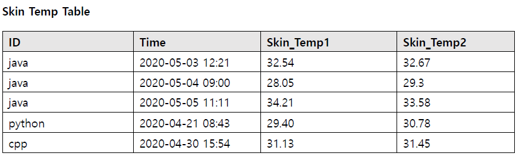
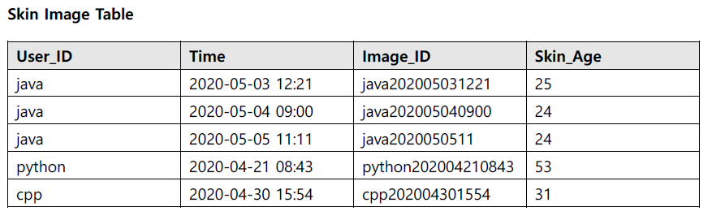

# 복합센서를 활용한 피부 진단 관리 시스템
   * 팀명 : 라이온 피부 구하기 
   * 제품/서비스명(브랜드) : 허스트(Hubble Skin Telescope)
    
   <br/>
   <br/> 
    
    
프로젝트 개요
---  
   * 자신의 피부를 육안으로만 확인해서는 자세히 알 수 없으며
이로 인하여 피부에 맞는 화장품 선택에 어려움을 겪을 수 있다.
피부 상태를 이미지로 분석해주는 어플리케이션이 있지만 한계가 있다.
이에 본 프로젝트에서는 센서를 통해 피부 데이터를 읽어 피부 상태를 분석해주고
이에 따른 맞춤 솔루션을 제공하는 어플리케이션을 제작하고자 한다.
세부적으로는 육안으로 확인하기 어려운 유수분 밸런스, 피부 온도 등을 측정하고
입력된 데이터를 분석하여 맞춤 대응 방법을 제공한다.
또한 프로그램을 반복하여 사용했을 경우 사용자에게 피부 상태 변화 과정을 한눈에 볼 수 있도록 해준다
   <br/>  
   <br/> 
   <br/>  
   <br/> 

  
  
서비스 구성도
---

  
<br/>
   <br/>  
   <br/>   
 <br/> 
 <br/>
<br/>


시스템 구성도
---


 <br/> 
 <br/> 


  <br/> 
  <br/> 
<br/>
<br/>


팀 구성 및 역할
---  
  
  
오정학(팀장)
   <br/>

```
 *  역할 : 머신러닝 모듈 제작
```

   <br/>  
   <br/>     
   
성진호(Committer)
   <br/>

```
 *  역할 : UI/UX 디자인, 웹페이지 제작, 데이터 저장하고 전송하는 서버구축 
```

   <br/>  
   <br/>

강수연
   <br/>

```
 *  역할 : 센서로 데이터 수집후 전송담당, 케이스제작, DB 구축 
```
   <br/>  
   <br/>  
   <br/>  
   <br/> 

   <br/>  
   <br/>  


프로그램 요구사항 및 머신러닝 처리계획
---  
   * DB의 데이터와 입력데이터를 비교하여 유수분 밸런스, 피부온도 등 피부의 전반적인 상태를 진단한다.
   * 머신러닝 처리 계획:
   <br/> 
   <br/> 
* 머신러닝 처리 계획:
CNN알고리즘을 이용하여 피부 이미지를 머신 러닝 처리 예정. 
처리 결과 피부의 건강 상태를 얻게 된다. 데이터 셋이 부족해 허스트를 통해 데이터를 먼저 모으고 보다 많은 데이터가 축적되면 정확도가 올라가게 될것이다.
   <br/> 
   <br/>    <br/> 
   <br/> 
   <br/>    <br/> 
   <br/> 


아두이노 연결
---  
   
   <br/>
   <br/> 
      <br/> 
   <br/> 

아두이노 핵심 코드
---  
   ``` c
   #include <ESP8266WiFi.h>
   #include <Wire.h>
   #include <Adafruit_MLX90614.h>

   Adafruit_MLX90614 mlx = Adafruit_MLX90614();
   WiFiClient client;

   void setup() {
      Serial.begin(115200);
      delay(10);
      mlx.begin();  
      WiFi.begin(ssid, password);

      ...
   }

   void loop() {
      float at = mlx.readAmbientTempC();
      float ot = mlx.readObjectTempC();
  
      if (isnan(at) || isnan(ot)) {
         Serial.println("Failed to read from sensor!");
         return;
      }

      if (client.connect(server,80)) {
         String postStr = ;
         ...
      }
      client.stop(); 
   }
   ```
  
   <br/> 
   <br/>    <br/> 
   <br/> 
   
   
데이터베이스 스키마
---  
   
   
   
   <br/>
   <br/> 
      <br/> 
   <br/> 
   <br/>
<br/>


예상 출력화면
---   
   
<br/><br/>
<br/>
<br/>
<br/>
<br/>

   
프로젝트 진행 중 문제점
---  

<br/><br/>
<br/>
<br/>
<br/>
<br/>


향후 일정 계획
---     

  
